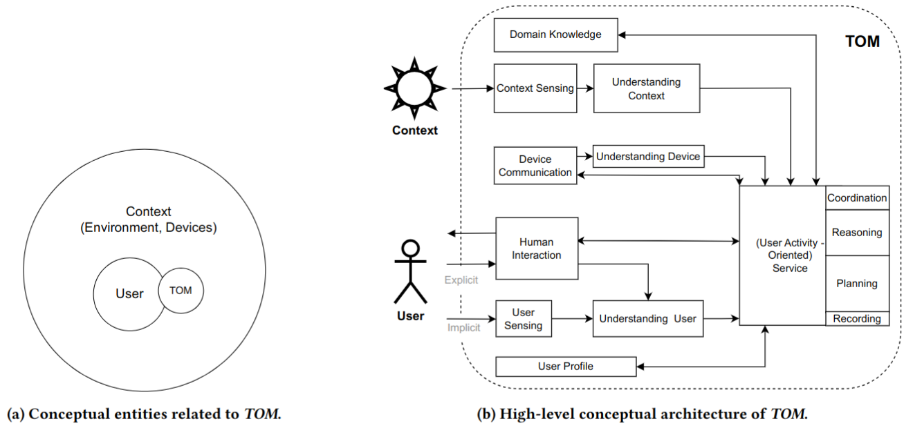

## TOM (The Other Me)
A Development Platform For Wearable Intelligent Assistants

- If you find any issues, please create GitHub issues on the corresponding repositories


## Repositories
- Please refer to [Publications](#Publications) for architecture and design details
- [TOM-Server-Python](https://github.com/TOM-Platform/TOM-Server-Python): A Python implementation of the server that handles the client data and application logic
- [TOM-Client-Unity](https://github.com/TOM-Platform/TOM-Client-Unity): A Unity implementation of the client to support smart glasses and phones that receive data from the server
- [TOM-Client-WearOS](https://github.com/TOM-Platform/TOM-Client-WearOS): A WearOS (Android smartwatch) application to read and send sensor data to the server


## Publications
- [TOM: A Development Platform For Wearable Intelligent Assistants](https://doi.org/10.1145/3675094.3678382), UbiComp/ISWC'24
  - Camera Ready [PDF](paper/Ubicomp24_TOM.pdf)
```
Nuwan Janaka, Shengdong Zhao, David Hsu, Sherisse Tan Jing Wen, and Chun Keat Koh. 2024. TOM: A Development Platform For Wearable Intelligent Assistants. In Companion of the 2024 ACM International Joint Conference on
Pervasive and Ubiquitous Computing Pervasive and Ubiquitous Computing (UbiComp Companion ’24). ACM. https://doi.org/10.1145/3675094.3678382 
```
- [Demonstrating TOM: A Development Platform for Wearable Intelligent Assistants in Daily Activities](https://doi.org/10.1145/3640471.3680445), MobileHCI'24
  - Camera Ready [PDF](paper/MobileHCI24_Demonstrating_TOM.pdf)
- [Demonstrating TOM: A Development Platform For Wearable Intelligent Assistants](https://doi.org/10.1145/3675094.3677551), UbiComp/ISWC'24
  - Camera Ready [PDF](paper/UbiComp24_Demonstrating_TOM.pdf)

- Video: [](https://youtu.be/jF5aA-_rCbM)


## Contact Persons
- [Nuwan Janaka](https://ssi.nus.edu.sg/#people) ([In](https://www.linkedin.com/in/nuwan-janaka/))
- [Chun Keat Koh](https://ssi.nus.edu.sg/#people)

## Contributors
- Initial work is done under the guidance of [Smart System Institute, NUS](https://ssi.nus.edu.sg) and [Synteraction (formerly NUS-HCI) Lab](https://synteraction.org/)
- Special thanks to the interns who worked under the TOM project
  - This include but not limited to; [@SherisseTJW](https://www.github.com/SherisseTJW), [@Jarrett0203](https://www.github.com/Jarrett0203), [@tau-bar](https://www.github.com/tau-bar), [@IDMYW](https://www.github.com/IDMYW), [@Hongyi6328](https://www.github.com/Hongyi6328), [@karanjotsv](https://www.github.com/karanjotsv), [@albertarielw](https://www.github.com/albertarielw), [@yitong241](https://www.github.com/yitong241), [@yiwen101](https://www.github.com/yiwen101), [@LOLIPOP-INTELLIGENCE](https://www.github.com/LOLIPOP-INTELLIGENCE), [@StanleyNeoh](https://www.github.com/StanleyNeoh), [@samuelthen](https://www.github.com/samuelthen), [@raihahahan](https://www.github.com/raihahahan), [@accountexeregister](https://www.github.com/accountexeregister), [@jonathanmui4](https://www.github.com/jonathanmui4), [@lshaoqin](https://www.github.com/lshaoqin), [@matochichap](https://www.github.com/matochichap), [@lsyurea](https://www.github.com/lsyurea), [@LordSaumya](https://www.github.com/LordSaumya), [@tyouwei](https://www.github.com/tyouwei)...


<!--

https://github.com/marketplace/actions/contribute-list

<a href="https://github.com/OWNER/REPO/graphs/contributors">
  
</a>


**Here are some ideas to get you started:**

🙋‍♀️ A short introduction - what is your organization all about?
🌈 Contribution guidelines - how can the community get involved?
👩‍💻 Useful resources - where can the community find your docs? Is there anything else the community should know?
🍿 Fun facts - what does your team eat for breakfast?
🧙 Remember, you can do mighty things with the power of [Markdown](https://docs.github.com/github/writing-on-github/getting-started-with-writing-and-formatting-on-github/basic-writing-and-formatting-syntax)
-->
